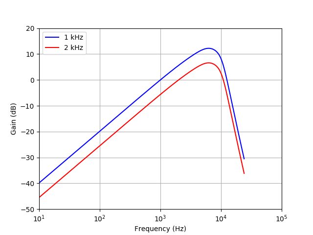
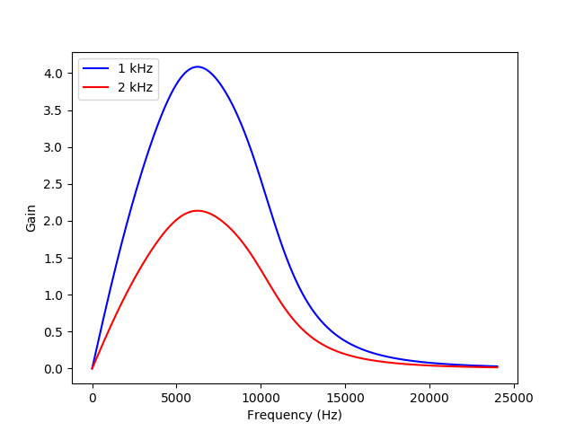

# itu-r-468-weighting

A zero dependency Python ITU-R 468 noise weighting filter (1 kHz and 2 kHz)

Master branch: [](https://travis-ci.com/cinelexi/itu-r-468-weighting?branch=master) [](https://coveralls.io/github/cinelexi/itu-r-468-weighting?branch=master) \
Dev branch: [](https://travis-ci.com/cinelexi/itu-r-468-weighting?branch=dev) [](https://coveralls.io/github/cinelexi/itu-r-468-weighting?branch=dev)

## Introduction

This project consists of a sole function named `r468`. The function takes a frequency value and returns a weighted gain value. For weightening, the [ITU-R BS.468-4](https://www.itu.int/rec/R-REC-BS.468-4-198607-I/en) standard and the [SMPTE RP 2054:2010](https://ieeexplore.ieee.org/document/7290513) recommended practice are followed.

The math for this project is taken from Wikipedia (as of 2019-08-08):

- https://en.wikipedia.org/wiki/ITU-R_468_noise_weighting ([archived version](https://web.archive.org/web/20190808084536/https:/en.wikipedia.org/wiki/ITU-R_468_noise_weighting))

### Filter with gain in dB ("db" option):



### Filter with gain factor ("factor" option):



## Installation

```
pip install itu-r-468-weighting
```

More infos on the [project page](https://pypi.org/project/itu-r-468-weighting/) at PyPI.

## Example Usage

```
from itu_r_468_weighting.filter import r468

r468(1000, "1khz", "db")      # returns gain in dB
r468(1000, "2khz", "db")      # returns gain in dB
r468(1000, "1khz", "factor")  # returns gain factor
r468(1000, "2khz", "factor")  # returns gain factor
```

## Function Description

See docstring in [function `r468`](https://github.com/cinelexi/itu-r-468-weighting/blob/master/itu_r_468_weighting/filter.py) for description.

## Contributing

See CONTRIBUTING.md file.

## Project page

This project is hosted on [GitHub](https://github.com/cinelexi/itu-r-468-weighting).
